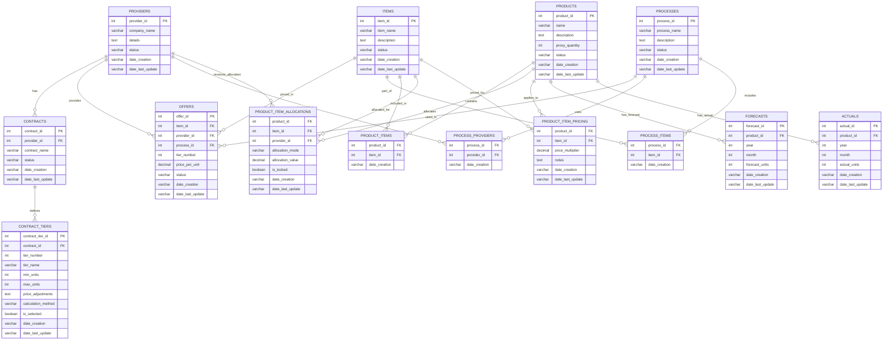
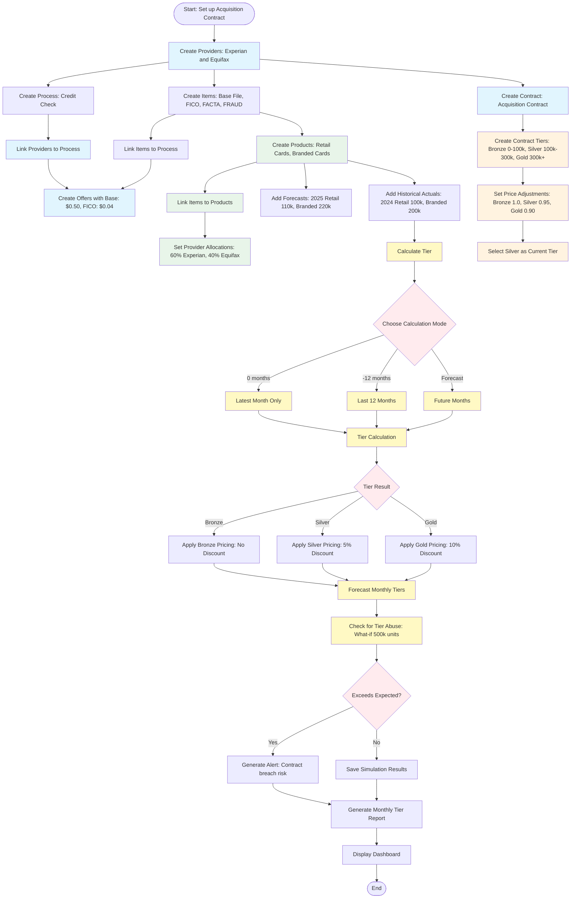
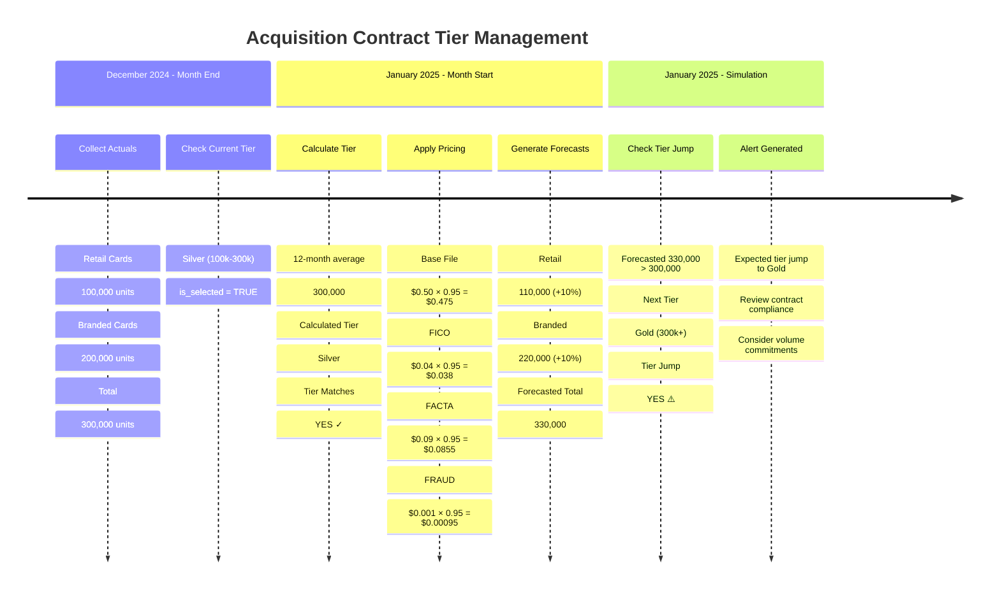

# Contract Tier Management System - Full Workflow

## Real-World Example: Acquisition Contract Tier Simulation

### Scenario Setup
- **Contract**: "Acquisition Contract" with Experian & Equifax
- **Products**: Retail Cards (100k units), Branded Cards (200k units)
- **Items**: Base File, FICO, FACTA, FRAUD
- **Tier Structure**: Bronze, Silver, Gold based on monthly volume

---

## Database Schema Workflow Diagram



---

## End-to-End Workflow Flowchart



---

## Tier Calculation Examples

### Example 1: Latest Month Calculation (0 months back)
```mermaid
sequenceDiagram
    participant User
    participant System
    participant DB

    User->>System: calculate_tier_for_contract(contract_id=1, months_back=0, use_forecasts=False)
    System->>DB: SELECT SUM(actual_units) WHERE year=2024 AND month=12
    DB-->>System: 300,000 units
    System->>DB: SELECT * FROM contract_tiers WHERE contract_id=1
    DB-->>System: Tiers: Bronze(0-100k), Silver(100k-300k), Gold(300k+)
    System->>System: 300,000 falls in Silver tier
    System-->>User: {
        "total_units": 300000,
        "selected_tier": {
            "tier_number": 2,
            "tier_name": "Silver"
        },
        "calculation_method": "0mo_actual"
    }
```

### Example 2: 12-Month Historical Calculation
```mermaid
sequenceDiagram
    participant User
    participant System
    participant DB

    User->>System: calculate_tier_for_contract(contract_id=1, months_back=-12, use_forecasts=False)
    System->>DB: SUM(actual_units) for 12 months (Jan-Dec 2024)
    DB-->>System: 3,600,000 units (100k × 12 months)

    System->>DB: SELECT tiers WHERE contract_id=1
    DB-->>System: Bronze(0-100k), Silver(100k-300k), Gold(300k+)

    System->>System: 3,600,000 ÷ 12 = 300,000 avg/month
    System->>System: 300,000 avg falls in Silver tier

    System-->>User: {
        "total_units": 3600000,
        "avg_monthly": 300000,
        "selected_tier": "Silver",
        "calculation_method": "12mo_actual"
    }
```

### Example 3: Forecast-Based Simulation
```mermaid
sequenceDiagram
    participant User
    participant System
    participant DB

    User->>System: simulate_contract_tiers(contract_id=1, forecast_months=[(2025,1), (2025,2)])
    loop for each month
        System->>DB: SELECT SUM(forecast_units) for month
        DB-->>System: Forecasted units
        System->>System: Determine tier based on forecast
    end

    System-->>User: {
        "results": [
            {
                "year": 2025,
                "month": 1,
                "forecast_units": 330000,
                "tier": "Gold"
            },
            {
                "year": 2025,
                "month": 2,
                "forecast_units": 350000,
                "tier": "Gold"
            }
        ]
    }
```

---

## Data Flow Diagram

```mermaid
graph TB
    subgraph "Step 1: Contract Setup"
        P1[Provider: Experian]
        P2[Provider: Equifax]
        C1[Contract: Acquisition]
        T1[Tier: Bronze<br/>0-100k units]
        T2[Tier: Silver<br/>100k-300k units]
        T3[Tier: Gold<br/>300k+ units]
    end

    subgraph "Step 2: Offer Definition"
        I1[Item: Base File - $0.50]
        I2[Item: FICO - $0.04]
        I3[Item: FACTA - $0.09]
        I4[Item: FRAUD - $0.001]
        O1[Offer: Experian-Tier2-Base]
        O2[Offer: Experian-Tier2-FICO]
        O3[Offer: Equifax-Tier2-Base]
        O4[Offer: Equifax-Tier2-FICO]
    end

    subgraph "Step 3: Product Configuration"
        PR1[Product: Retail Cards<br/>100k units/month]
        PR2[Product: Branded Cards<br/>200k units/month]
        PI1[Links: Base+FICO+FACTA]
        PI2[Links: Base+FICO+FACTA+FRAUD]
        PA1[Allocation: 60% Experian]
        PA2[Allocation: 40% Equifax]
    end

    subgraph "Step 4: Volume Tracking"
        F1[Forecast: 2025<br/>Retail 110k, Branded 220k]
        A1[Actual: 2024<br/>Retail 100k, Branded 200k]
    end

    subgraph "Step 5: Tier Calculation"
        TC1[Calculate: 12mo actual avg]
        TC2[Result: 300k units/month]
        TC3[Decision: Silver Tier]
        TC4[Apply: 5% discount]
    end

    P1 --> O1
    P2 --> O3
    I1 --> O1
    I2 --> O2
    PR1 --> PI1
    PR2 --> PI2
    PI1 --> PA1
    PI2 --> PA2
    A1 --> TC1
    TC1 --> TC2
    TC2 --> TC3
    TC3 --> TC4

    classDef provider fill:#2196f3,color:#fff
    classDef contract fill:#9c27b0,color:#fff
    classDef tier fill:#ff9800,color:#fff
    classDef item fill:#4caf50,color:#fff
    classDef product fill:#009688,color:#fff
    classDef tracking fill:#f44336,color:#fff

    class P1,P2 provider
    class C1 contract
    class T1,T2,T3 tier
    class I1,I2,I3,I4 item
    class PR1,PR2 product
    class F1,A1 tracking
```



---

## Monthly Workflow Example

### Scenario: December 2024 → January 2025



---

## API Usage Examples

### 1. Set Up Contract and Tiers
```python
# Create contract for Equifax
contract = crud.create_contract(
    provider_id=equifax_id,
    contract_name="Acquisition Contract"
)

# Create tier structure
tier1 = crud.create_contract_tier(
    contract_id=contract["contract_id"],
    tier_number=1,
    tier_name="Bronze",
    min_units=0,
    max_units=100000,
    price_adjustments={"base": 1.0, "fico": 1.0},
    is_selected=False
)

tier2 = crud.create_contract_tier(
    contract_id=contract["contract_id"],
    tier_number=2,
    tier_name="Silver",
    min_units=100000,
    max_units=300000,
    price_adjustments={"base": 0.95, "fico": 0.98},
    is_selected=True  # Currently active
)

tier3 = crud.create_contract_tier(
    contract_id=contract["contract_id"],
    tier_number=3,
    tier_name="Gold",
    min_units=300000,
    max_units=None,
    price_adjustments={"base": 0.90, "fico": 0.95},
    is_selected=False
)
```

### 2. Calculate Tier (12 months historical)
```python
result = crud.calculate_tier_for_contract(
    contract_id=contract["contract_id"],
    months_back=-12,
    use_forecasts=False
)

# Returns:
# {
#     "total_units": 3600000,
#     "selected_tier": {
#         "tier_number": 2,
#         "tier_name": "Silver",
#         "price_adjustments": {"base": 0.95, "fico": 0.98}
#     },
#     "calculation_method": "12mo_actual"
# }
```

### 3. Simulate Future Tiers
```python
forecast_months = [
    (2025, 1), (2025, 2), (2025, 3),
    (2025, 4), (2025, 5), (2025, 6)
]

simulation = crud.simulate_contract_tiers(
    contract_id=contract["contract_id"],
    forecast_months=forecast_months
)

# Returns monthly tier progression
```

### 4. Manually Switch Tiers
```python
# Manually select Gold tier
crud.set_selected_contract_tier(
    contract_id=contract["contract_id"],
    contract_tier_id=tier3["contract_tier_id"]
)
```

---

## Key Benefits

✅ **Flexible Tier Calculation**: Support for 0, 6, 12+ month lookback periods
✅ **Forecast Simulation**: Predict future tier jumps based on forecasts
✅ **Historical Analysis**: Analyze past tier performance
✅ **Abuse Detection**: Identify when usage exceeds contract terms
✅ **Manual Override**: Ability to manually select/adjust tiers
✅ **Price Transparency**: Track price adjustments per tier
✅ **Compliance Monitoring**: Ensure contract adherence

---

## Copy This File

Save this as `CONTRACT_TIER_WORKFLOW.md` and open in any Markdown viewer that supports Mermaid diagrams (GitHub, GitLab, VS Code with Mermaid extension, Mermaid Live Editor).
